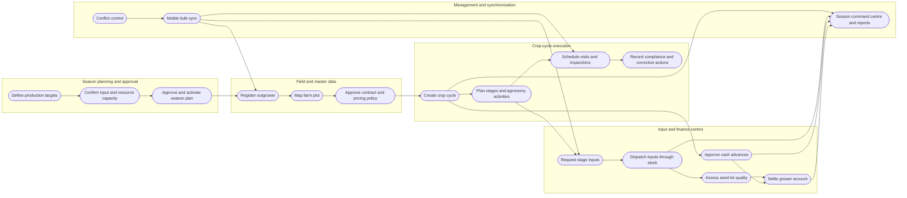
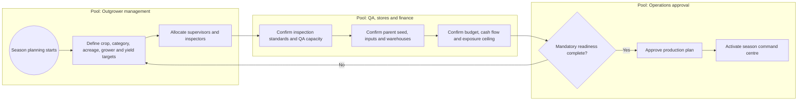
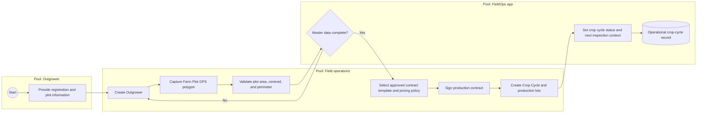
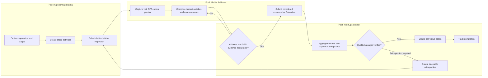
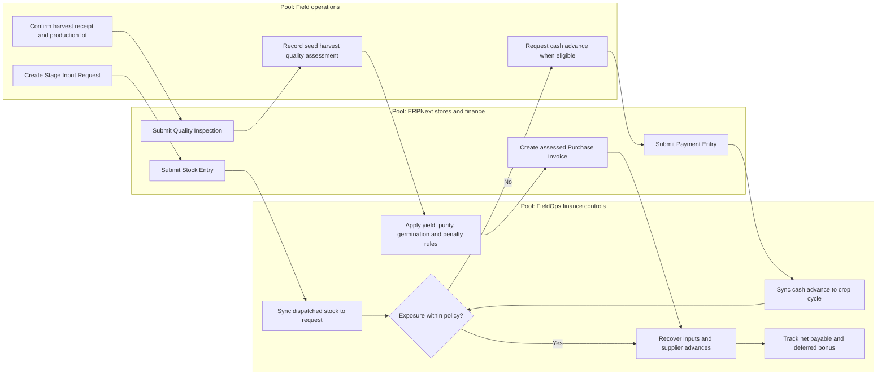

# NASECO FieldOps Executive Process Overview

Document revision: R006  
Generated: 2026-07-31 12:05  
Source: `main` at `3e047ed`  
Capability fingerprint: `6110e6ed2a74b463`

## Executive Message

NASECO FieldOps connects season production planning, outgrower registration, plot mapping, signed crop-cycle contracts, agronomy execution, inspection quality, input financing, seed-lot quality assessment, harvest settlement, and mobile synchronization in one managed Frappe/ERPNext application. The app creates a controlled operational record from approved seasonal intent through field execution and financial recovery.

The Season Production Plan is the management baseline. It defines regional crop and seed-category targets, parent seed and input demand, staffing capacity, milestones, readiness evidence, budget and exposure controls. Each resulting crop cycle links approved terms to the grower, plot, production lots, activities, inspections, inputs, advances, harvest value, and final settlement. The Season Command Centre and managerial reports compare actual execution with that baseline.

## Current Capability Snapshot

| Measure | Current value |
|---|---:|
| Total FieldOps DocTypes | 58 |
| Parent transaction/master DocTypes | 35 |
| Child table DocTypes | 23 |
| Mobile/API mapped stores and objects | 79 |
| Unique mobile/API target DocTypes | 39 |
| ERPNext finance event objects | 4 |

| Process area | Managed objects | Examples |
|---|---:|---|
| Grower and land master data | 6 | Farm Plot, Outgrower, Plot Crop Assignment, Plot Photo, Plot Vertex, Region |
| Crop planning and agronomy | 10 | Agronomy Activity Template, Crop, Crop Cycle, Crop Cycle Stage, Crop Recipe, Crop Variety, plus 4 more |
| Season planning and command control | 6 | Season Input Requirement, Season Milestone, Season Production Plan, Season Production Target, Season Readiness Item, Season Resource Allocation |
| Contract and commercial governance | 6 | Crop Production Lot, Outgrower Pricing Band, Outgrower Pricing Policy, Outgrower Production Contract, Production Contract Signatory, Production Contract Template |
| Field execution and inspection | 13 | Field Corrective Action, Field Visit, Inspection, Inspection Attribute, Inspection Parameter, Inspection Result, plus 7 more |
| Inputs, advances, harvest, and settlement | 11 | Crop Cycle Advance Request, Crop Cycle Harvest Receipt, Crop Cycle Settlement, Crop Cycle Settlement Adjustment, Crop Cycle Settlement Cash Advance, Crop Cycle Settlement Pricing Line, plus 5 more |
| Mobile sync and controls | 2 | Sync Conflict, Sync Log |
| Other app objects | 4 | Agronomy Report, Agronomy Report Parameter, Agronomy Report Result, Agronomy Report Template |

## Managed Process Architecture



## BPMN View 1: Season Planning And Activation



## BPMN View 2: Outgrower To Active Crop Cycle



## BPMN View 3: Agronomy, Inspection, QA Review, And Corrective Action



## BPMN View 4: Inputs, Advances, Harvest, And Settlement



## How The App Manages Interdependencies

| Interdependency | App control |
|---|---|
| Season plan to operations | Approved regional targets, input demand, resource allocation, milestones and readiness controls govern season activation. |
| Grower to land | Outgrower records link to Farm Plot GPS boundaries and plot photos. |
| Land to production | Farm Plot records anchor Crop Cycles, seasons, crops, varieties, and assignments. |
| Contract to crop cycle | Submitted contract templates and category-specific pricing policies are snapshotted into signed production contracts. |
| Production to field work | Crop Cycles drive stages, activities, agronomy reports, inspections, compliance and corrective actions. |
| Field work to input usage | Stage Input Requests and Dispatches connect agronomy plans to stock movement. |
| Input and cash exposure | Recoverable stock value, cash advanced, pending advance, exposure, and capacity live on the crop cycle. |
| Harvest to settlement | Production lots, receipts, Quality Inspections, moisture-normalized quantity, germination, genetic purity and penalties determine the initial payable value. |
| Quality to deferred bonus | Potential genetic-purity bonuses remain outside initial settlement until QA approval and due-date control. |
| Mobile to server | Role and assignment scoped sync keeps supervisors and Quality Inspectors within their own work while preserving offline operation. |
| ERPNext to FieldOps | Stock Entry (before_validate, before_submit, on_submit, on_cancel), Payment Entry (on_submit, on_cancel), Purchase Receipt (before_validate), Purchase Invoice (on_submit, on_cancel) events synchronize financial and stock outcomes into FieldOps controls. |

## Executive Control Points

1. Season readiness: production cannot be approved until mandatory target, quality, input, warehouse, staffing and finance controls are evidenced.
2. Segregation of duties: Outgrower Managers plan, Quality Inspectors capture mobile evidence, the existing Quality Manager verifies QA, and operations approvers authorize the season.
3. GPS-backed accountability: inspection takes require stable high-accuracy coordinates, plot-boundary validation and spacing around the five-metre standard.
4. Stage-based agronomy: activities, reports and recipe inputs are scheduled against the standard crop-cycle stages.
5. Exposure management: recoverable inputs and supplier advances remain visible against forecast and assessed harvest value through settlement.
6. Exception handling: reinspections, corrective actions, readiness gaps, overdue work, input shortages and sync conflicts create explicit follow-up through ToDos and reports.

## Auto-Refresh Model

This document is generated by `tools/update_executive_process_overview.py`. The generator reads DocType metadata, mobile/API mappings, and ERPNext event hooks, then increments the document revision only when the source capability fingerprint changes. A local pre-commit hook is included so the overview is refreshed before commits that improve the app.

To refresh manually:

```bash
python3 tools/update_executive_process_overview.py
```

To verify without rewriting:

```bash
python3 tools/update_executive_process_overview.py --check
```
